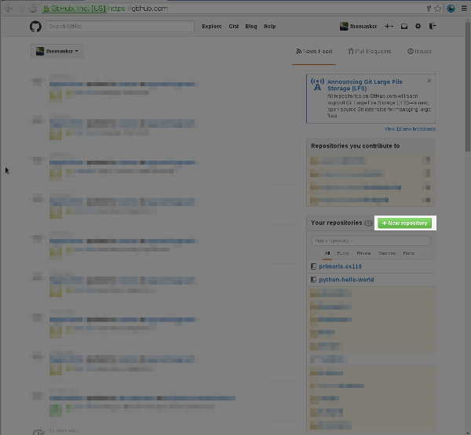
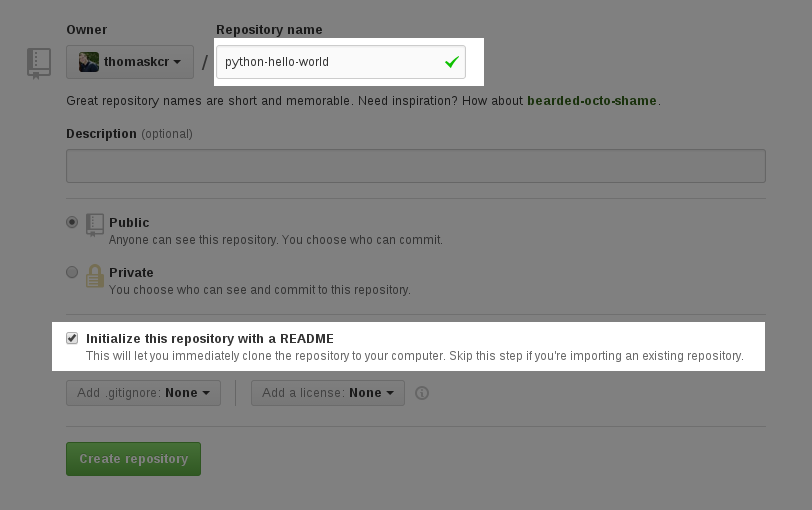
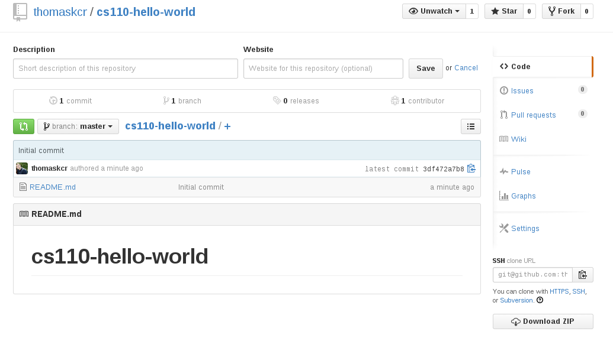
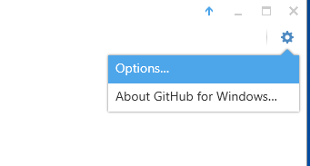
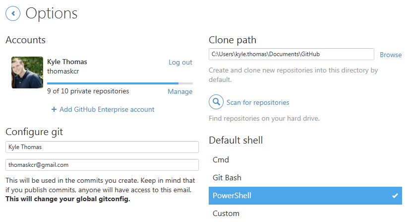
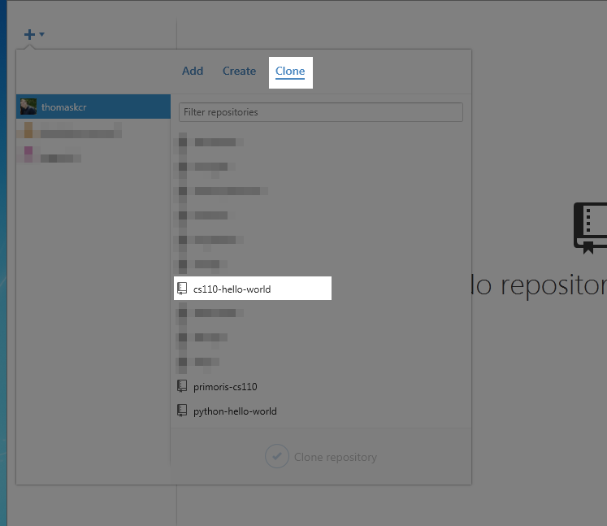
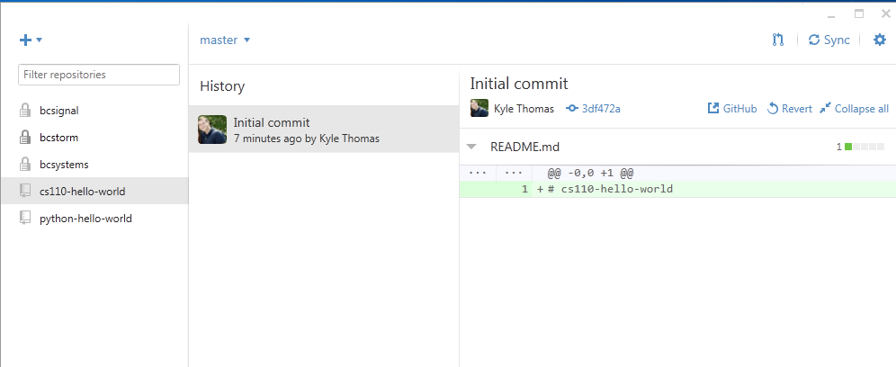
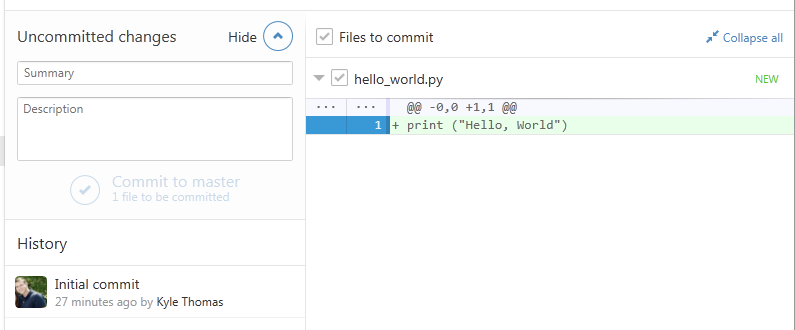
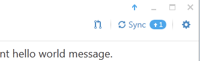

Hello World Lab
===============

This will be our first lab. We'll use this as an opportunity to make sure that everything is set up right on your computer and you can run Python programs. We'll also make sure your GitHub account is created and you know how to create commits and push your code. 

What this lab does is pretty simple, we're going to print "Hello, World" like we did in the walkthrough. 

Create Hello World Repository
-----------------------------

Go to http://www.github.com and login to your account. If you have not created an account, refer back to the lecture notes on GitHub. 

Once you are logged into your account and on the GitHub homepage, click on "Create Repository". 

Enter the information about your repository. For this project we'll be naming it "cs110-hello-world" (note, in my example I just named it "python-hello-world" so make sure to name yours right!) and we'll be creating a README file. 

Your repository now exists and is shared. After you click "Create Repository" it should look like this

Clone Your Repository
---------------------

Open your GitHub application on your computer. You can check whether you're signed into your account properly by clicking the gear in the upper right hand corner and then choosing "Options". 

If you are signed in your options screen will look similar to the image below with your GitHub username and a randomly generated image. 

If you are not signed into your account, go back to the GitHub lecture notes to see how to do this. 

To clone your repository, click on the "+" in the upper left hand corner. Select the "Clone" tab and then select your repository. 

If done correctly, your GitHub application screen should look like the following

Write Hello World
-----------------

Just like we did during the walkthrough, write a script that writes "Hello, World!". Remember, you will need to use the :code:`print()` function to do this. 

Save your application to the GitHub repository that you just cloned. 

Create a Commit and Push Your Project
-------------------------------------

When you save a new file to the folder for your GitHub repository, an "Uncommited changes" panel will show up in the GitHub application. If you click the down arrow in this panel it will show your new file and changes. It will also open a form where you can add your commit message and create your commit. 

If this panel does not show up, you most likely saved your project to the wrong folder. You can click "Save As" and make sure that you save your project to the right folder or you can move your file to the correct folder. 

Add a message in the "Summary" part of the form saying what you just did. Then click the "Commit to master" button. This creates a commit. 

Your commit is now on your computer, but you want it to also be on the server. To do that we'll need to push our code. 

To push your code, click the "Sync" button in the upper right hand corner. 

Edit Your README.md File
------------------------

Your README file gives information about what your project does as well as any information needed to run your project. 

On GitHub, we'll write our README files using something called "GitHub Flavored Markdown". Markdown is what we call a format. For now, we'll only look at one markdown command. The title command is a single "#". Our project title is "Hello World" so edit the title in your README file. 

Paragraph text is just written normally so write a sentence or two explaining what your project does. 

To separate lines in markdown you need to press enter twice instead of once. After writing your summary, press enter twice. 

In addition to saying what your project does, you'll want to share information on running your project. In this case, you'll want to specify that your project will only run under Python 3 (in Python 2 the print statement is different). So make sure to add a sentence saying your project was written for Python 3. 

Your README.md file might look similar to the following

::

    # Hello World

    This repository contains the code for the Week 1 Hello World lab. This program prints "Hello, World" to the console. 

    This code requires Python 3 to run. 

Once you've edited your file, commit your changes and push it to the GitHub server.

Rubric
------

- **[5 Points]** Student has a GitHub repository under their username named :code:`cs110-hello-world`
- **[20 Points]** Student has a :code:`hello_world.py` script in their repository that prints "Hello, World!" when run. 
- **[15 Points]** Student has a properly formated :code:`README.md` file in their repository
- **[10 Points]** Student has 3 commits in their repository (the initial commit, the hello world file commit and the README update commit)
  - The initial commit will be made automatically
  - Make sure your commit messages for the other two are good, you will also be graded on whether your commit messages reflect what you did in that commit. 
