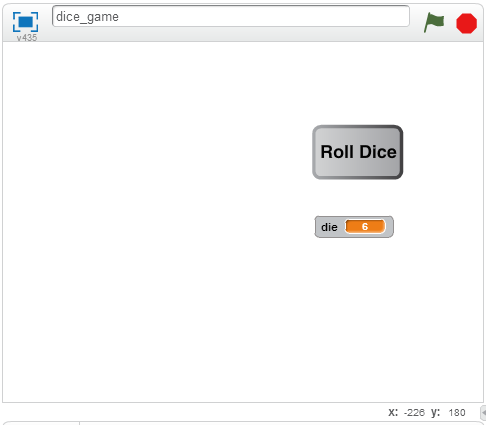
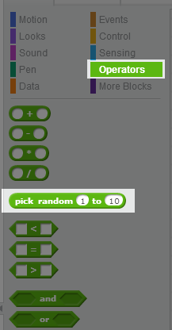
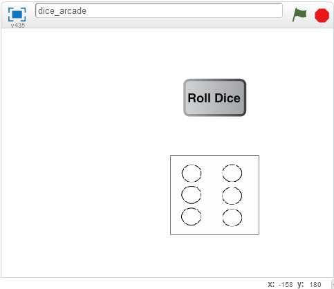
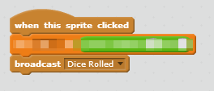
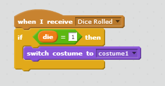
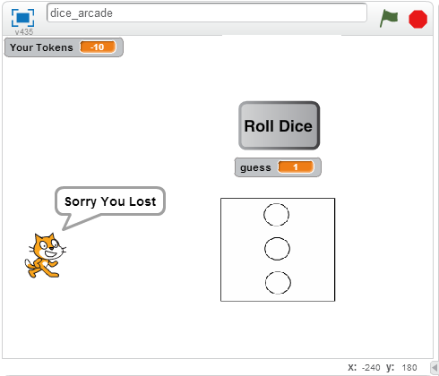

Scratch Dice Game
=================

In this lab were going to create a dice game. This lesson will cover a few different topics in the Scratch system and allow us to explore **tuning** a game.  

Topics covered in this lab: 

- Random Numbers
- Conditionals
- Events and Messages
- Tuning (Expected Value)

You're going to create a game that allows you to roll a dice, guess a number and win tokens if they guess the number rolled on the dice right. If they are wrong, they will lose tokens. We'll calculate how many tokens you should win if you guess correctly and how many you should lose if you are wrong. We want our game to be fun, if your players lose too quickly the game won't be fun. If you get too many tokens when you win, then players will always win and there won't be any excitement. 

Rolling the Dice
----------------

Lets start by creating the code to roll our dice. Your program at this point will look something like this: 

1. Add a button to your project
2. Add text to your button that says "Roll Dice"
3. Add a variable to your project called "die"
4. When you click the "Roll Dice" button, set the value of "die" to a random dice value
   - What is the highest dice number?
   - What is the lowest? 

Hints
~~~~~

Your "Roll Dice" button is a sprite. To do something when a sprite is rolled, you need to go to "Events". 

To create a random number, you'll need the "pick random" operator. 

Showing the Dice
----------------

The best games are visually exciting, and seeing a number is not very exciting. Lets replace the die variable being printed with an actual dice. 

1. Add a **New Sprite**
2. Create 6 **Costumes** for this sprite, one for each side of a die
3. Change the costume of the dice sprite based on the value of the :code:`die` variable

Events
~~~~~~

We've used clicking for most of our events, now we need to use a **Message**. 

You can tell every sprite an event happened using the **broadcast message** block. 

Create a new event called :code:`Dice Rolled`. 

Change Dice Costume
~~~~~~~~~~~~~~~~~~~

When the dice are rolled, we need to show the correct dice costume. 

We know when the dice has been rolled because the :code:`Dice Rolled` message will be broadcast. 

We can test the value of the :code:`die` variable and then change the costume to the correct one. Below is an example for the rolled value 1. 

You will need to add the rest of the code. 

Getting the Player's Guess
--------------------------

We'll need to get the player's guess to see if they win or lose. 

1. Create a variable called :code:`guess`
2. Ask the player for their guess
3. Store the player's guess in the variable :code:`guess`

Hints
~~~~~

You'll need to use the "Ask and Wait" block in the "Sensing" category. The player's response will be stored in "answer".

Winning and Losing
------------------

For my demo, I used the cat to tell the player whether they won or lost. You can tell the player they won or lost any way you want. 

1. Add a block to trigger when the :code:`Dice Rolled` event is received
2. Test whether the guess is the same as the value of the dice
  - If the values are the same, display a "You Win" message
  - If the values are not the same, display a "You Lose" message.

Tracking Tokens
---------------

We've already created a game, but it only lets us play once. Let's add a layer to the game that allows a longer game. 

We're going to keep track of the number of tokens a player has and allow them to win more if they guess correctly. To make the game exciting we'll also take some away if they lose. 

1. Add a variable to keep track of the user's tokens called :code:`Your Tokens`
2. When the flag is clicked, set this to an initial value of 10
3. If the user wins, add a token to their total
4. If the user loses, remove a token from the total

Extra Credit: Tuning
--------------------

You may notice that your number of tokens always goes down if you play long enough, there is no way to win right now. 

The problem is that you have a 1/6 chance of winning. That means for every 6 rolls, you will lose 5 tokens and win 1. 

Change the number of tokens won to ensure the game lasts as long as possible. If you make it too high, the user will always win over time. As you've seen, if the tokens won is too low you'll always lose over time. 

- What number did you choose? 
- Why did you chose your number? 

What Next?
----------

Did you like this lab? There is a lot you can do to improve it if you want to keep working on it. Here are some ideas:

- Only allow users to input numbers between 1 and 6. You can have the cat tell them their input was not good if it is not a number between 1 and 6. 
- Allow the user to set the number of tokens to bet. Instead of taking 1 token, you can allow the user to choose how many tokens.
- Allow users to guess multiple numbers. For example, they can guess it will be a 1 or 2. If the dice value is 1 or 2 they win, otherwise they lose. You'll want to adjust the tokens they win though or the game will be too easy!
