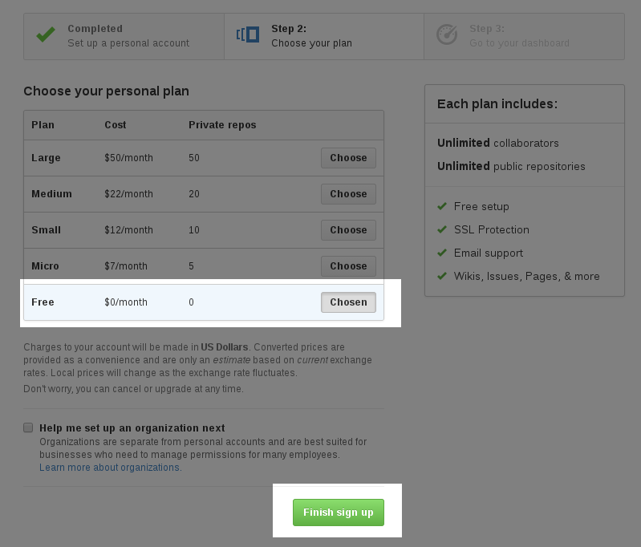

GitHub Basics
=============

We will use GitHub to track our projects and submit assignments. 

Version Control
---------------

Version control is software that tracks changes to files within a project over time. Regardless of project size, it is always wise to use version control of some type. It allows the developer to revert files or even the entire project to any state, track changes over time and when working in teams see who made what changes. 

For this class we are going to use a version control program called git. We will only explore a couple of the commands git provides in this class but it is a powerful tool used on large projects such as the Linux kernel, Arduino, and the Whitehouse Petitions site to name a few. 

A project in git is called a **repository**. Each lab for this course will be its own repository. Repositories are just like normal folders, they can contain more folders and files. 

When building complex programs, it is best to break the problem down into smaller pieces. The labs for this class will be mostly large problems broken down into smaller pieces. You will create a **commit** after you complete each part of your project. A commit is similar to a save point in a game. It allows you to go back to that point at anytime. You will give each commit a message saying what you did and changed. You can always go back and see what files changed between any two commits as well. 

You will only need to know six commands to get started working with git, and the GitHub client will provide a visual interface for all of them so you don't need to use the command line. 

- :code:`clone`
- :code:`init`
- :code:`add`
- :code:`commit`
- :code:`push`
- :code:`pull`

Creating an Account
-------------------

To sign up for an account, go to http://github.com. Enter a username, email and password and then click "Sign up for GitHub". 

Complete the second step by clicking "Finish sign up". By default, the free account will be selected. 

You now have a GitHub account setup. Download the GitHub for Windows application by going to https://windows.github.com/

Creating a New Repository
-------------------------

To create a repository start on the GitHub homepage. Click on "Create Repository". 

Enter the information about your repository. Your name can't have spaces, we usually use dashes instead. 

You should always select "Initialize this repository with a README", this will make the process of getting started easier for now until we learn more commands in git. 

Cloning Your Repository Locally
~~~~~~~~~~~~~~~~~~~~~~~~~~~~~~~

The repository you created exists on the GitHub server, but not on your computer. We need to do a process called **cloning** to get a copy on our computer. 

Open your GitHub application on your computer. You can check whether you're signed into your account properly by clicking the gear in the upper right hand corner and then choosing "Options". 

.. image:: github-options.png
    :align: center
    :scale: 60%

If you are signed in your options screen will look similar to the image below with your GitHub username and a randomly generated image. 

.. image:: github-settings.png
    :align: center
    :scale: 60%

If you are not signed into your account, go back to the GitHub lecture notes to see how to do this. 

To clone your repository, click on the "+" in the upper left hand corner. Select the "Clone" tab and then select your repository. 

.. image:: github-clone.png
    :align: center
    :scale: 60%

If done correctly, your GitHub application screen should look like the following

.. image:: github-home.png
    :align: center
    :scale: 60%

Creating a Commit
~~~~~~~~~~~~~~~~~

Every time you finish some work, you will want to create a commit. This is a record of your code as it was at a specific point in time. You will be able to use GitHub to see what changed in your code between commits and you can always go back to your code at any point in time. 

When you save a new file to the folder for your GitHub repository, an "Uncommited changes" panel will show up in the GitHub application. If you click the down arrow in this panel it will show your new file and changes. It will also open a form where you can add your commit message and create your commit. 

.. image:: commit-ready.png
    :align: center
    :scale: 60%

Add a message in the "Summary" part of the form saying what you just did. Then click the "Commit to master" button. This creates a commit. 

Pushing Your Commits
~~~~~~~~~~~~~~~~~~~~

When you create your commit, it only exists on your computer. We need to tell the GitHub server about this commit. To do this we will use the **Sync** button in the GitHub application. This will execute a :code:`push` and send your code to GitHub. 

To push your code, click the "Sync" button in the upper right hand corner. 

Editing the README File with Markdown
-------------------------------------

Your README file is for telling other people about your project. This can include things like how to install the required libraries, how to run your code, how to edit your code and anything else. 

We'll only cover a few commands but you can find more information on markdown here: https://help.github.com/articles/markdown-basics/

Paragraphs
~~~~~~~~~~

To separate paragraphs in markdown you need to press enter twice instead of once. After writing your summary, press enter twice. 

Headings
~~~~~~~~

To create a heading we use the :code:`#` symbol. One :code:`#` is the document title, two (:code:`##`) is a section, three is a subsection and so on. The maximum is 6. 

::

    # My Project

    This is a project I have been working on that does this. 

    ## Installing My Project

    This is some information about installing my project. 

    This is a new paragraph. 

Text Styles
~~~~~~~~~~~

Markdown allows you to make text **bold** and *italic*. 

::

    Markdown allows you to make text **bold** and *italic*. 

Lists
~~~~~

To make a bulleted list, just put a :code:`-` at the start of the line. 

::
    
    - Item 1
    - Item 2
    - Item 3

- Item 1
- Item 2
- Item 3

