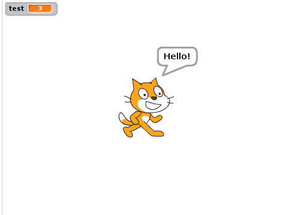

Introduction
============

This is the first set of notes to go along with our course work. In this section we will explore some of the concepts needed to begin to think and problem solve like a programmer. This includes things like vocabulary, understanding what a programming language is and what's needed to get started writing Python programs. 

Solving Problems
----------------

Programming is a specific way of solving problems. It's a combination of math, engineering and science to come up with a method of solving a problem, and then writing your solution out as instructions. 

Just about anything you can solve using code can be done by hand or using other methods, but programming allows you to solve much bigger problems and do them much faster. 

Games are the theme of this class and many of the games we'll create we've already played without a computer. While games like tic-tac-toe and battleship work just as well without a computer, there are many games that would be significantly less fun without a computer. 

Multiplication Tables and Extra Credit
~~~~~~~~~~~~~~~~~~~~~~~~~~~~~~~~~~~~~~

Lets look at how programming could offer a better solution to a real life problem. Imagine a situation where your teacher creates an assignment to write out the times table for 9. Your teacher says that for every entry past 9 x 9, you will get one point of extra credit. She even says that you don't need to write the entries yourself. 

The most obvious solution is to go home and just start writing. :code:`9 x 1 = 9`, :code:`9 x 2 = 18`, and you continue writing. You figure out that you can write about one entry every 3 seconds by just adding 9 to the last number. Every minute you earn 20 points of extra credit, pretty good! After a few minutes your hand begins to cramp up though, so you decide to stop after 8 minutes. You feel that 160 points of extra credit is more than enough. The next day you hand in your assignment.

A few days later your assignment comes back and you only earned 10 extra points! You look as see that on the 20th entry you accidentally added 8 instead of 9 and all of your entries past there are wrong. 

Let's stop and look at this problem and some of it's solutions: 

- We could have solved it by typing every entry into a calculator to ensure that no mistakes were made, but that takes about 10 second per entry. That means that after 8 minutes we'd only earn 48 points instead of 160. 
- Another solution is to type every 10th entry into the calculator. In this situation the worst case scenario is only 10 mistakes that need to be corrected and we can still earn about 133 extra points in the same time if we don't make any mistakes. 

What are my main problems here? 

- I am slowed down by how fast I can do math and write.
- I make mistakes. 

As we read above, computers are actually very fast at doing math. Additionally, computers always do exactly what they are told. The computer will always return the right answer to a math problem when asked. 

If we use programming to solve this problem, we could write code to print out the multiplication tables as high as we want. We can output these to a file and then print that file to hand into the teacher. We've now eliminated the problem of mistakes and are only limited by how many pages we can print. The average lines per page is about 40 when printing, so if you have 100 sheets of paper you could earn 4000 points of extra credit and go play video games while it prints. 

General Solutions
~~~~~~~~~~~~~~~~~

In our above example, we solved a very specific problem: printing the times table for the number 9. A program that only solves one problem is only useful one time. For those that took the Scratch class, just like the example we learned to solve very specific problems. For example, "write a program that allows you to navigate this maze". 

In this course, we're going to expand on that ability. We'll learn how to solve general problems. Instead of writing a program to print out the 9 times table, we'll write a program to print out **any** times table. Instead of writing a program to play a specific maze, we'll write a program that allows you to play **any** maze. 

We'll be writing programs that answer many similar questions instead of one specific question.

Thinking Like a Programmer
--------------------------

Programming is taking the solution to these general problems and writing it in a way that the computer can read and execute your instructions. 

Algorithms
~~~~~~~~~~

The list of instructions that are executed is called the **algorithm**. This is a list of operations that if performed exactly will solve the problem. 

Algorithms aren't specific to programming, you've already experienced and used many algorithms. The following are all examples of algorithms

- Putting things in order of size.
- Multiplying numbers.
- Lining up in alphabetical order. 

Algorithms are the solutions to your problems, programming is the implementation of your algorithm. 

Programming Languages
~~~~~~~~~~~~~~~~~~~~~

One of the first questions we may want to answer is why do we need programming languages to tell computers what to do? Why can't we just use English? English is an example of what we call a natural language. When we program, we use formal languages. 

Surprisingly, most of the things that exist in natural languages exist in programming languages. Programming languages have grammar and punctuation that communicate meaning for example. When you write a sentence, you communicate it's done using a period. In Python you will use the enter key to indicate a line is done. 

The reason we need to use a programming language is because we need to communicate to the computer **exactly** what we want it to do. Many of the things we say when giving spoken instructions to a friend can mean different things depending on the situation and who is hearing it. 

Lets look at some examples

- **"Go over there."**

  This sentence might work for a person but requires a lot more information for a computer to interpret. You may be pointing somewhere, looking at a location or even nod towards where you want the person to go. It can even be interpreted differently based on the person hearing it. One person may go 100 feet away in the direction you point while another may only go 10 feet.

  For a computer, we would need to define an exact location and then tell the computer to go to that location. This requires a way to communicate a location with a computer (a common example is a grid, in scratch we used x/y positions) and then an instruction that the computer understands means "go to this location". 

- **"Wait a minute..."**

  This is an example of where the way a word or phrase is commonly used does not mean exactly what you said. To a computer, a minute is 60 seconds. If you tell your mom you'll be down in a minute for dinner, she understands that means "shortly". This is also an example where confusion can occur because different people have different ideas of "a minute" when you mean "shortly". 

This is why we have programming languages. They have very specific rules that are meant to allow you to communicate exactly what you want. These are called instructions. 

In Scratch, we used blocks to represent our instructions to get the program to do what we wanted. The blocks are our language, every block means something specific. In the following example, every block has an exact meaning. The code shown is for the sprite shown in the output figure.

- The program starts when the flag is pressed. We know that block means "do the next thing when the flag is pressed". 
- The second line we know means "set the value stored in the variable named :code:`test` to 3". Both we and the computer know exactly what we mean with that "sentence". 
- For the third line you need to remember that this code is specific to the sprite shown in the output figure below. We know that "say" will show a speech bubble that contains whatever value we give "say"
- The final line will show the value held in the variable :code:`test`. In line two we set that value to 3, so this shows that :code:`test` contains the value 3 in the output. 

Here is the output that is shown when our program is executed: 

For this course, we're going to be using Python. The instructions in Python will be defined using written commands rather than blocks that we can drag and drop. 

Programs
~~~~~~~~

A program is the sequence of instructions that are executed to perform our algorithm. We can write code that will execute the same algorithm in different languages as we will see below where we start comparing Scratch and Python. As we discussed, the program is the implementation of the algorithm. A program will be in a specific programming language, an algorithm will generally be described in a natural language. 

There are a few instructions that appear in most languages 

- **Input** This could be getting data that a user enters or from a file. There are programs that take input from devices such as the Kinect. 
- **Output** This can refer to when data is displayed to the user, written to a file or even an interaction with a device. For example, thinkgeek.com sells orbs that you can write code to change the color of. For a web application I could write a program to make it so my orb glows red when the page is not loading. 
- **Numeric Operations** Just about every language has a way to do math (addition, subtraction, etc). String operations are also very common, but Scratch did not have string operations by default. 
- **Conditionals** These are decisions where a piece of code is only executed if the statement is true. 
- **Repetition** Allow you to do something multiple times. For example, if you need to print the numbers 1 through 10, instead of writing 10 print statements you can loop through the numbers. 

Sorting Cards Example
~~~~~~~~~~~~~~~~~~~~~

Python
------

Python is a programming language designed to be easy to read which makes it a great language for beginners to learn. 

Just like Scratch, Python is what we call an **interpreted language**, which means the code will be executed by an **interpreter**. In Scratch, the interpreter was online. We enter our code by moving blocks and then click run telling the interpreter to read and execute the code we have written. 

In Python the interpreter will be on our computer instead of online. We will need to install an interpreter that understands Python and will be able to execute it. 

Installing the Interpreter
~~~~~~~~~~~~~~~~~~~~~~~~~~

To install Python, start by downloading the installer from the `Python Downloads`_ page. Once downloaded, run the installer and follow the instructions on the screen. The default options will install everything needed to the correct locations. 

Once completed, your computer will have everything it needs to execute Python programs. 

Using the Interactive Shell
~~~~~~~~~~~~~~~~~~~~~~~~~~~

To open an interactive Python shell, click on your "Start Menu". Expand "All Programs" and navigate to the "Python 3.4" folder and expands that as well. Click on the "IDLE (Python 3.4 GUI - 32 bit)" program.  

This will open a python shell that looks similar to the following

The interactive shell allows you to execute lines of Python code. Below you can see an example of two commands being executed in the interactive shell. As you can see the result of the command is printed when you execute it. 

Installing an IDE
-----------------

**Note:** This section borrows heavily from Paul Vincent Craven's `Arcade Games with Python`_. His website is a great resource for video lectures, quizzes, notes, examples and more all related to Python and using pygame. 

We have now seen the interactive shell and how we can execute Python commands but it would be very inconvienent if we needed to type in our commands again every time we wanted to execute them. As we will see soon, we can save a set of commands to a file and then direct the interpreter to run those commands. This is very similar to how in Scratch we could export a program and then load it from our computer again later. We will not be using files in this chapter, but one of the goals of this chapter is to be fully set up to begin developing so we'll need to install one more program to be ready. 

A Python file is just a text file with a list of commands that the computer will execute in order when we run the interpreter. Since its just a text file we can actually edit this file using any text editor. Windows comes with a text editor called Notepad. 

Python also installs a text editor for us called IDLE. The editor provided has a lot of advantages over Notepad. It allows us to run code directly from the editor and it also has a feature called **syntax highlighting**. This means that it will color the text on your screen differently based on what it is. Expressions will be a different color than strings for example. 

The editor that comes with Python does have some issues and limitations though, especially when working with pygame. For that reason, we are going to install an IDE. 

IDE stands for "Integrated Development Environment". When we worked in Scratch, the application inside the web browser was an example of an IDE. It allowed us to develop, run and test our code. IDEs provide a lot of features to make development easier. 

When working on games, there are two major issues that are the reason we'll be using an IDE instead of the IDLE editor. 

    "Issue 1, when working with multiple files it is difficult to keep track of the all the open files. It is easy to forget to save a file before running the program. When this happens the program runs with the old code that was saved rather than the new code. This is very confusing."

    "Issue 2, if there is an error in a program that does graphics the Python program will crash and “hang.” Once the program has crashed it is difficult to shut down. The error message that describes why it crashed is often buried and difficult to find."

    -- Paul Vincent Craven `Arcade Games with Python`_

.. image:: bad_idle.png
    :align: center

The figure above, taken from Paul Craven's page, shows what happens when an error occurs while working with pygame using idle and the issues it will cause. 

To address these issues, we will use the Wing IDE. A free version of this can be downloaded from the `Wing IDE 101`_ website. 

The same program with the same error is shown being run in Wing IDE in the figure below (also taken from Paul Craven). Not only is it easier to terminate the program, but Wing will show you exactly where the error is occuring making it a lot easier to fix. 

For now, just install the Wing editor. We will actually use it during the walkthrough associated with this lesson. 

.. _`Python Downloads`: https://www.python.org/downloads/
.. _`Arcade Games with Python`: http://programarcadegames.com/index.php?showpart=0#section_0.3
.. _`Wing IDE 101`: http://wingware.com/downloads/wingide-101/