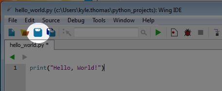

Saved Programs
==============

We've now used the Python interactive shell to execute some commands but as we said it would be very inconvinent if you had to retype your programs every time you wanted to execute them. In this chapter we'll learn how to use WingIDE to write, save and execute our programs. 

Writing a Program in Wing IDE
-----------------------------

Start by opening Wing IDE. To create a new Python file, click the "Create a New File" logo in the upper left hand corner. This is highlighted in the iamge below. 

A file named "untitled-1.py" will be created. To close a file, click the red X. 

The play button in this image is what you will use to run your programs. Lets write a program. 

"Hello, World!" is the traditional first program in any language. Add the following code to your new Python file

::

    print("Hello, World!")

Press the play button. 

In the image below you can see this code and the expected output. 

Saving Your Program
~~~~~~~~~~~~~~~~~~~

To save your project, press the "Save" icon

Organizing your projects is important. I created a folder called "python_projects" to save my projects for this class. 

Opening Your Project
~~~~~~~~~~~~~~~~~~~~

To open a project you previously worked on, click on the "Open File" icon. 

Find your project (this is why organization is important!) and open it. You will then be able to edit, save and execute it as you did before. 

