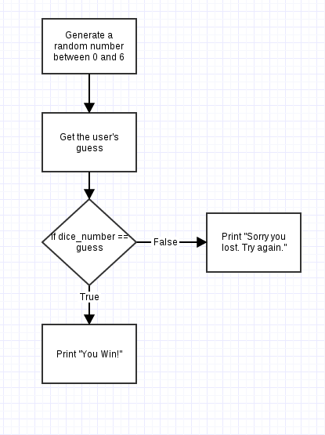

Dice Game
=========

We're going to create a dice game. The program will roll a 6 sided die and then we will guess the number. If the player guesses the number correctly they win. 

We'll start by making a flowchart describing what we want to happen. 

The flowchart breaks down the major parts of the program we'll need to write. 

Create Repository
-----------------

Before starting, I'm going to create a GitHub repository for this project so I can have my code version controlled. 

I go to http://www.github.com and click on the "New Repository" button. I'm going to name this repository "dice-game" and create it with a README.md file. 

On my computer, I open the GitHub application and clone my repository by clicking the plus and then going to the Clone tab. 

I am now ready to start programming, so I open my Wing IDE. 

Roll Dice
---------

The first block on my flowchart is the dice roll. I need to simulate the roll of a 6 sided dice so I am going to generate a number between 1 and 6. I'll need my random library and I am going to use :code:`randrange` for this since I want an integer. 

I don't want the number zero included, so I know my lower bound will be 1. I want the number 6 included but remember that the :code:`randrange` function goes up to but not including the second number. This means my second number will need to be 7. 

::
    
    import random 

    # Roll the dice and get a number between 1 and 6
    dice_number = random.randrange(1, 7)

I save the file to the folder for my dice-game GitHub repository as :code:`dice_game.py`.

I want to make sure I'm right up to this point so I'm going to add a print statement and then execute my code a few times to make sure I'm getting different dice numbers and they are in the correct range. 

::
    
    import random 

    # Roll the dice and get a number between 1 and 6
    dice_number = random.randrange(1, 7)

    print(dice_number)

I can then run the program a few times to make sure I get the right result

::
    
    3.4.3 (v3.4.3:9b73f1c3e601, Feb 24 2015, 22:43:06) [MSC v.1600 32 bit (Intel)]
    Python Type "help", "copyright", "credits" or "license" for more information.
    [evaluate dice_game.py]
    4
    [evaluate dice_game.py]
    5
    [evaluate dice_game.py]
    6
    [evaluate dice_game.py]
    1
    [evaluate dice_game.py]
    5
    [evaluate dice_game.py]
    3

Everything seems in order so far, so I can delete my print statement. 

::
    
    import random 

    # Roll the dice and get a number between 1 and 6
    dice_number = random.randrange(1, 7)

At this point, I've solved a part of my problem and have a working program so it's a good time for a commit. I create a commit with the summary "Wrote code to roll dice and save value."

Get User's Guess
----------------

The next part of this program is getting the users guess. We'll want to tell the user what their input should be and then use the :code:`input()` function to get their input. 

This input is also going to be compared to a number so we're going to want to convert it to an integer. 

::
    
    import random 

    # Roll the dice and get a number between 1 and 6
    dice_number = random.randrange(1, 7)

    # Get users guess from input
    print("Guess the number rolled on the six sided dice:")
    user_guess = input()

    # Convert the users guess to an integer
    user_guess = int(user_guess)

Once again we can use a print statement to make sure the number I input is being stored in the :code:`user_guess` variable. Once I confirm this, it's another good time for a commit. 

I create my commit with the message "Get user's guess for value of dice roll."

Determine if User Won
---------------------

The last part of this game is determining if the user won. We'll use an if statement to see if the user's guess and the value rolled on the dice are the same. 

::
    
    import random 

    # Roll the dice and get a number between 1 and 6
    dice_number = random.randrange(1, 7)

    # Get users guess from input
    print("Guess the number rolled on the six sided dice:")
    user_guess = input()

    # Convert the users guess to an integer
    user_guess = int(user_guess)

    # Decide if the user is a winner
    if dice_number == user_guess:
        print("You Win!")
    else
        print("Sorry you lost. Try again.")

We can now test the game. You may want to print the value of the dice roll so you can make sure that your comparison is working right. Printing the value of the dice roll will allow you to compare what you typed to the rolled value and if they are the same confirm that you won. If you lose when you typed in the right number there is a logic error somewhere in your code.

I create my commit with the message "Added logic to decide if user is a winner."
