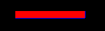

Week 3: Introduction to Pygame
==============================

Walkthrough
-----------

You will turn in these 5 exercises in a single repository called :code:`cs110-pygame`. Name each file :code:`exercise_#.py`. 

Each exercise is worth 10 points and correctly using GitHub for this project is another 10 points for a total of **60 points**. 

Screens and Colors
~~~~~~~~~~~~~~~~~~

This first exercise will show you how to create a screen, allow users to quit your game and change colors. 

::
    
    import pygame
    import sys

    screen = pygame.display.set_mode((700, 400))

    screen.fill((0, 0, 255))

    while True:
        for event in pygame.event.get():
            if event.type == pygame.QUIT:
                pygame.quit()
                sys.exit()
        
        pygame.display.flip()

Lets break this program down part by part. 

::
    
    import pygame
    import sys

We start by importing two libraries, pygame and sys. Pygame is our game engine and sys will provide the exit command we need. 

::
    
    screen = pygame.display.set_mode((700, 400))

This line will open a window that is 700 pixels wide and 400 pixels tall and then stores it in a variable called :code:`screen`. Figure :num:`fig-pygame-screen` shows how the coordinate system works. 

.. _fig-pygame-screen:

    This shows the coordinate system for Pygame windows.

:: 
    
    screen.fill((0, 0, 255))

This line will set the background color of the screen. Every color is represented by three numbers. The first is the amount of red, 0 means no red and 255 means all red. The second number is green and the last is blue. 

This works a bit different than mixing paint, the colors are what we call additive. This is shown in Figure :num:`fig-additive-color`. 

.. _fig-additive-color:

    A representation of additive color mixing. Image created by Mike Horvath. 

This statement is outside the while loop because we only need to color in the screen once. 

::
    
    while True:

This is an infinite while loop, this allows our program to run until we specifically tell it to exit. 

::
    
    for event in pygame.event.get():
        if event.type == pygame.QUIT:
            pygame.quit()
            sys.exit()

On every iteration of the while loop, this code will run through each event and check to see if it is the quit event. The quit event is triggered by clicking the red "x" in the upper right corner. If the quit event has been triggered, :code:`pygame.quit()` and :code:`sys.exit()` will cause the program to exit. 

::
    
    pygame.display.flip()

Finally, this line of code will update the screen. If you comment out this line of code you will see that the screen never turns blue because it was changed but never "rendered". 

This statement is inside the loop because we want to update our screen with every cycle. While it doesn't matter for this example, we'll want to get in the habit of putting this code here for later. 

**Exercise 1**: Modify the above code to make the background of the screen your favorite color and name the file :code:`exercise_1.py`. 

Drawing Shapes
~~~~~~~~~~~~~~

We'll add the following functions in this exercise. 

.. function:: pygame.draw.line(screen, color, point_1, point_2)

    This function will draw a line starting at `point_1` and ending at `point_2`. Just like with the screen fill function, color is a tuple with the values red, green and blue (i.e. :code:`color = (255, 0, 0)` for red).

.. function:: pygame.draw.rect(screen, color, (x,y,width,height), thickness)
    
    Draw a rectangle where (`x`, `y`) is the upper left hand corner. If thickness is 0 the rectangle will be filled. 

.. function:: pygame.draw.circle(screen, color, (x,y), radius, thickness)
    
    Draw a circle with its center at (`x`, `y`). If the thickness is 0 the circle will be filled. 

Here is an example program using these new functions to draw shapes. 

::

    
    import pygame
    import sys

    screen = pygame.display.set_mode((700, 400))

    screen.fill((0, 0, 0))

    # Create a blue line that starts at (0, 0) and ends at the middle of the
    # screen at point (350, 200)
    pygame.draw.line(screen, (0, 0, 255), (0, 0), (350, 200))

    # Create a green rectangle with the upper left corner at (100, 200),
    # a width of 50 and a height of 100. Since the thickness is 0 the
    # rectangle is filled in.
    pygame.draw.rect(screen, (0, 255, 0), (100, 200, 50, 100), 0)

    # Create a green rectangle with the upper left corner at (200, 200),
    # a width of 5 and height of 100. Since the thickness is 2 the
    # rectangle is only outlined with a line with thickness 2.
    pygame.draw.rect(screen, (0, 255, 0), (200, 200, 50, 100), 2)

    # Create a red circle with the center at (500, 100) and a radius of 50.
    # Since the thickness is 0 the circle will be filled in.
    pygame.draw.circle(screen, (255, 0, 0), (500, 100), 50, 0)

    while True:
        for event in pygame.event.get():
            if event.type == pygame.QUIT:
                pygame.quit()
                sys.exit()
            
        pygame.display.flip()

Figure :num:`fig-drawing-output` shows the output from this program when it is run. Make sure you can run this and get the same output. 

.. _fig-drawing-output:

    Output from running the code for drawing shapes. 

**Exercise 2**: Draw your own simple picture using these shapes. An example might be a house, a car or something similar. 

Mouse Events
~~~~~~~~~~~~

Every time the mouse is moved an event is fired. The event type is :code:`MOUSEMOTION`. We can also capture mouse clicks and releases (:code:`MOUSEBUTTONDOWN` and :code:`MOUSEBUTTONUP`). 

In the below code we print messages with every mouse event. 

- Every time the mouse is moved we print the new position
- Every time the left button (defined as button number 1 in pygame) is pressed we print the position it was clicked at
- Every time the left button is released we print the position it was released at

These messages will be printed to your console not the Pygame window so make sure you're looking in the right place. Notice you can click the button and then release it in a different position. 

::

    import pygame
    import sys

    screen = pygame.display.set_mode((700, 400))

    while True:
        for event in pygame.event.get():
            if event.type == pygame.QUIT:
                pygame.quit()
                sys.exit()
            elif event.type == pygame.MOUSEMOTION:
                print("Mouse Position (%d, %d)" % event.pos)
            elif event.type == pygame.MOUSEBUTTONDOWN and event.button == 1:
                print("Left Mouse Button Pressed at: (%d, %d)" % event.pos)
            elif event.type == pygame.MOUSEBUTTONUP and event.button == 1:
                print("Left Mouse Button Released at: (%d, %d)" % event.pos)

        screen.fill((0, 0, 0))

        pygame.display.flip()

Rather than just printing the mouse position, lets do something in the pygame screen. We'll change the program to draw a circle where we click the left mouse button and clear the screen when we click the right button. 

It's important to notice that the right button is not button 2! Button 2 is the middle button, button 3 is the right button. 

::

    import pygame
    import sys

    screen = pygame.display.set_mode((700, 400))

    screen.fill((0, 0, 0))

    while True:
        for event in pygame.event.get():
            if event.type == pygame.QUIT:
                pygame.quit()
                sys.exit()
            elif event.type == pygame.MOUSEBUTTONDOWN and event.button == 1:
                # Draw a circle at the position where the button was pressed. 
                # The circle is filled in and red with a radius of 15 pixels
                pygame.draw.circle(screen, (255, 0, 0), event.pos, 15, 0)
            elif event.type == pygame.MOUSEBUTTONDOWN and event.button == 3:
                # Color the screen black again
                screen.fill((0, 0, 0))

        pygame.display.flip()

We'll see later this method doesn't actually remove those circles, it just covers them with a new back screen. 

**Exercise 3**: Rather than drawing a circle when the mouse button is clicked, draw a line that starts from the lower left hand corner and ends where the mouse is clicked. 

Moving Things
~~~~~~~~~~~~~

So far we've really only drawn static objects, what if we want to move the same object around the screen? This section of the walkthrough will explore one way of doing that. 

Our goal for this exercise is to draw a rectangle and move it around the screen. Really we'll just be giving the illusion that the rectangle is moving. 

::
    
    import pygame
    import sys

    screen = pygame.display.set_mode((700, 400))

    # Start our object in the upper left hand corner at (0, 0)
    x_position = 0
    y_position = 0

    while True:
        for event in pygame.event.get():
            if event.type == pygame.QUIT:
                pygame.quit()
                sys.exit()
            elif event.type == pygame.KEYDOWN:
                if event.key == pygame.K_UP:
                    # Move Piece Up
                    y_position -= 1
                elif event.key == pygame.K_DOWN:
                    # Move Piece Down
                    y_position += 1
                elif event.key == pygame.K_LEFT:
                    # Move Piece Left
                    x_position -= 1
                elif event.key == pygame.K_RIGHT:
                    # Move Piece Right
                    x_position += 1

        # Blank out the entire screen
        screen.fill((0, 0, 0))

        # Draw the rectangle at its current position
        pygame.draw.rect(screen, (0, 255, 0), (x_position, y_position, 10, 10), 0)

        pygame.display.flip()

In this program, when we push the up or down key the :code:`y_position` variable is changed. Remember back to what the coordinate system looks like. 

**Exercise 4**: Make the following updates to my code:

- Make the rectangle move faster
- Don't allow the user to move the rectangle off the screen 

Collisions
~~~~~~~~~~

An important part of making games is checking whether two objects have collided with each other. So far, we have just drawn rectangles with every iteration. We will now create rectangle objects and then draw those objects. 

Here is how we have been drawing rectangles

::
    
    pygame.draw.rect(screen, (0, 255, 0), (x_position, y_position, 10, 10), 0)

There is no object for us to work with using this method though. We are now going to create a "player" rectangle.

::
    
    # Create a player rectangle object
    player = pygame.Rect(x_position, y_position, 10, 10)

    # Draw the player rectangle
    pygame.draw.rect(screen, (0, 255, 0), player)

We will now create a small game where the goal is to reach a "goal brick" in order to win the game. 

::
    
    import pygame
    import sys

    screen = pygame.display.set_mode((700, 400))

    # Create a rectangle object that represents the goal
    goal = pygame.Rect(50, 50, 10, 10)

    # Start our player at position 0, 0
    x_position = 0
    y_position = 0

    # Create a player rectangle
    player = pygame.Rect(x_position, y_position, 10, 10)

    while True:
        for event in pygame.event.get():
            if event.type == pygame.QUIT:
                pygame.quit()
                sys.exit()
            elif event.type == pygame.KEYDOWN:
                if event.key == pygame.K_UP:
                    # Move Piece Up
                    y_position -= 1
                elif event.key == pygame.K_DOWN:
                    # Move Piece Down
                    y_position += 1
                elif event.key == pygame.K_LEFT:
                    # Move Piece Left
                    x_position -= 1
                elif event.key == pygame.K_RIGHT:
                    # Move Piece Right
                    x_position += 1

        # Update the x and y position of the player rectangle
        player.x = x_position
        player.y = y_position

        # Check whether the player rectangle has collided with the goal block
        if player.colliderect(goal):
            pygame.quit()
            sys.exit()

        # Draw everything
        screen.fill((0, 0, 0))

        pygame.draw.rect(screen, (0, 0, 255), goal)

        pygame.draw.rect(screen, (0, 255, 0), player)

        pygame.display.flip()

**Exercise 5**: Add a second goal block to this game. 

Lab: Cannon Game
----------------

We're going to create a cannon game for this lab. The player will use the arrow keys to change the power and angle of their cannon to fire shells at enemy forces. 

This lab is worth a total of **100 Points**. The points are outlined below adding up to 80 points and the final 20 points will be based on your use of GitHub including your README file and commit messages. 

I have outlined the code to get you started. Copy the following code into a file called :code:`cannon_game.py`. 

::

    import pygame
    import sys
    import math
    import random
    import time

    screen = pygame.display.set_mode((700, 400))
    clock = pygame.time.Clock()

    # Initialize Constants
    # cannon_base_x =
    # cannon_base_y =
    hypotenuse = 50
    gravity = -9.8

    # Initialize Variables
    # cannon_power =
    # cannon_angle =

    # Create Enemy
    # enemy_position_x =
    # enemy = pygame.Rect(enemy_position_x, 390, 50, 10)

    while True:
        for event in pygame.event.get():
            if event.type == pygame.QUIT:
                pygame.quit()
                sys.exit()
            elif event.type == pygame.KEYDOWN:
                if event.key == pygame.K_LEFT:
                    # Decrease Cannon Power
                    pass
                elif event.key == pygame.K_RIGHT:
                    # Increase Cannon Power
                    pass
                elif event.key == pygame.K_UP:
                    # Move Cannon Up
                    pass
                elif event.key == pygame.K_DOWN:
                    # Move Cannon Down
                    pass
                elif event.key == pygame.K_SPACE:
                    # A Projectile has been launched!
                    # cannon_angle_radians = math.radians(cannon_angle)

                    # opposite =
                    # adjacent =

                    # cannon_nose_x =
                    # cannon_nose_y =

                    # velocity_x = cannon_power * math.cos(cannon_angle_radians)
                    # velocity_y = cannon_power * math.sin(cannon_angle_radians)

                    # Time starts at zero
                    t = 0.0

                    # Bullet starts at the end of the cannon
                    # bullet_pos_x = cannon_nose_x
                    # bullet_pos_y = cannon_nose_y

                    # while bullet_pos_y <= 400:
                    #     bullet_dist = velocity_x*t
                    #     bullet_height = velocity_y*t + 0.5 * gravity * t**2

                    #     bullet_pos_x = cannon_nose_x + bullet_dist
                    #     bullet_pos_y = cannon_nose_y - bullet_height

                    #     pygame.draw.rect(screen, (255, 0, 0),
                    #                      (bullet_pos_x, bullet_pos_y, 5, 5), 0)

                    #     pygame.display.flip()
                    #     t += 0.01

                    #     time.sleep(0.002)

                    # Make an explosion!
                    # pygame.draw.circle(screen, (255, 0, 0),
                    #                    (int(bullet_pos_x), int(bullet_pos_y)),
                    #                    15, 0)
                    pygame.display.flip()

                    # Check for a hit
                    # explosion_rect = pygame.Rect(bullet_pos_x - 15, 395, 30, 10)

                    # if explosion_rect.colliderect(enemy):
                    #    print ('Winner!')

                    #    # We won so generate a new enemy
                    #    enemy_position_x = random.randint(350, 650)
                    #    enemy = pygame.Rect(enemy_position_x, 390, 50, 10)

                    # time.sleep(3)

        # Draw the power meter

        # Draw the cannon
        # cannon_angle_radians = math.radians(cannon_angle)

        # opposite =
        # adjacent =

        # cannon_nose_x =
        # cannon_nose_y =

        # pygame.draw.line(screen, (0, 0, 255),
        #                  (cannon_base_x, cannon_base_y),
        #                  (cannon_nose_x, cannon_nose_y), 3)

        # Draw the enemy
        # pygame.draw.rect(screen, (0, 255, 0), enemy)

        pygame.display.flip()
        clock.tick(20)

Drawing the Power Meter
~~~~~~~~~~~~~~~~~~~~~~~

The maximum power for the cannon will be 100, the minimum power is 0. 

Start by implementing the ability to add and remove power from the cannon. You'll find the code stub for that in the project starting file

::
    
    if event.key == pygame.K_LEFT:
        # Decrease Cannon Power
        pass
    elif event.key == pygame.K_RIGHT:
        # Increase Cannon Power
        pass

- **[10 Points]** Allow user to change cannon power
    * Initialize the :code:`cannon_power` variable as half the maximum power. 
    * When the user pushes the right arrow key, raise the cannon power by 1
    * When the user pushes the right arrow key, do not allow the cannon power to go over 100
    * When the user pushes the left arrow key, lower the cannon power by 1
    * When the user pushes the left arrow key, do not allow the cannon power to go under 0

We'll want to create a power meter to show the user what the current power setting is. To do this, we'll draw a rectangle outline and then put a rectangle inside indicating how much power there is. 

    

    
- **[10 Points]** Show power meter to user 
    * Draw outline rectangle. Since the maximum power is 100, make it 100 pixels wide. 
    * Draw inside rectangle. Since the outer rectangle is 100 pixels wide, we can use the current :code:`cannon_power` as the width of the inner cannon. 

Drawing the Cannon
~~~~~~~~~~~~~~~~~~

Just like above, start by allowing the user to change the value of the the :code:`cannon_angle`. The cannon angle will go from 0 degrees (pointing straight horizontal) to 90 degrees (pointing straight up). 

- **[10 Points]** Allow user to change cannon angle
    * Initialize the :code:`cannon_angle` variable as half the maximum angle. 
    * When the user pushes the up arrow key, raise the cannon angle by 1
    * When the user pushes the up arrow key, do not allow the cannon angle to go over 90
    * When the user pushes the down arrow key, lower the cannon angle by 1
    * When the user pushes the down arrow key, do not allow the cannon angle to go under 0

We're going to represent the cannon with a line. You'll need to do some math in this part of the lab. 

The only variable we can change is the angle of the cannon but in order to draw a line we need to have two x, y coordinates. The line that makes up the cannon will go from :code:`(cannon_base_x, cannon_base_y)` to :code:`(cannon_nose_x, cannon_nose_y)`. 

Start by defining the constants for the cannon base. These will not change while our program is running so they will just be a number. Our cannon base should be located at the bottom of the screen, and we want it to be 50 pixels away from the left edge. Based on the size of the screen, you can calculate what they should be.  

- **[5 Points]** What should :code:`cannon_base_x` be set to?  __________
- **[5 Points]** What should :code:`cannon_base_y` be set to?  __________

.. _fig-cannon-drawing:

    Diagram showing relationship of cannon variables

We now need to find the nose position. Our cannon length is a constant, defined by :code:`hypotenuse` and we have an angle for our cannon. If you look at Figure :num:`fig-cannon-drawing` you can see the cannon actually is part of an imaginary triangle. We can use trigonometry to find the nose position. 

Figure :num:`fig-right-triangle` shows the relationship between trigonometry functions and triangle sides for reference. 

.. _fig-right-triangle:

    Diagram showing how to solve a triangle (http://home.windstream.net/okrebs/Ch9-1.gif)

You will need to use the math library to solve the triangle

.. function:: math.sin(x)
    
    Return the sine of x radians.

.. function:: math.cos(x)

    Return the cosine of x radians.

We keep track of the cannon angle in degrees though. The :code:`math.radians` function converts the cannon angle into radians. Make sure you use the :code:`cannon_angle_radians` variable for your sine and cosine functions. 

The :code:`hypotenuse` constant is the length of the cannon, the value is already defined for you as 50 for this project. 

- **[5 Points]** What should :code:`opposite` be set to? (use Figures :num:`fig-cannon-drawing` and :num:`fig-right-triangle`)  __________________
- **[5 Points]** What should :code:`adjacent` be set to? (use Figures :num:`fig-cannon-drawing` and :num:`fig-right-triangle`)  ___________________

We now know how to calculate the height (:code:`opposite`) and base (:code:`adjacent`) of the imaginary triangle. The numbers are relative to the base of the triangle (the corner at :code:`common_angle`). 

For example, with 45 degrees the opposite and adjacent variables are both 35.36. But if we draw a line from somewhere near the lower left to (35.36, 35.36) the line crosses the entire screen. You will now need to calculate the cannon nose positions on the pygame grid. 

- **[5 Points]** What should :code:`cannon_nose_x` be set to? (use Figure :num:`fig-cannon-drawing`)  __________
- **[5 Points]** What should :code:`cannon_nose_y` be set to? (use Figure :num:`fig-cannon-drawing`)  __________

Create an Enemy
~~~~~~~~~~~~~~~

We'll be creating an enemy tank in a random location. To do this, we'll use the :code:`random.randint()` function. 

We only need to generate one random number, the tank should always be on the ground and will always be the same height and width. These numbers have been filled in for you

:: 

    enemy = pygame.Rect(enemy_position_x, 390, 50, 10)

Notice that even though the maximum y value is 400, our y value is 390. This is because the tank is 10 pixels tall. 

The closest that the enemy tank can be is right in front of our cannon. The furthest is at the end of the map. Remember, the tank is 50 units long and rectangles start from the top left corner! 

- **[5 Points]** Generate the :code:`enemy_position_x` variable

Allow Firing Bullet
~~~~~~~~~~~~~~~~~~~

This is mostly a physics problem. A lot of this code has been included for you and the derivation of the formulas will be discussed in class as part of the lecture. 

- **[20 Points]** Working projectile logic
