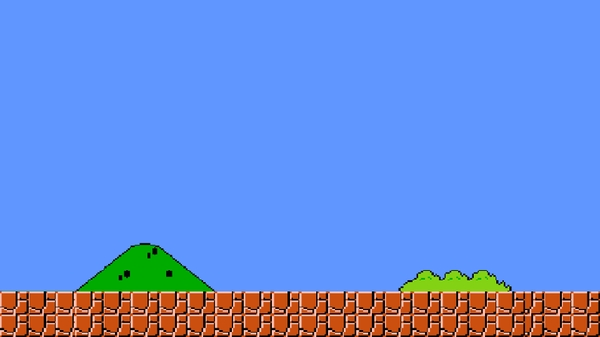

Game Graphics and Motion
========================

Setting a Background Image
--------------------------

So far all of our games have had a solid color background. In this section we'll learn how to set our own background image. 

Download the following image:

Save it to a new folder called "mario". In that folder, create a file called "demo.py". We will need to load our image and then show it on the screen. Adding an image to the screen is called "blitting" in pygame and we'll use the "blit" command to do it. 

The blit command is run on the screen. It takes an image and the position of the image. 

::

    import pygame
    import sys

    pygame.init()

    screen = pygame.display.set_mode((700, 500))

    background_image = pygame.image.load("mario_background.jpg").convert()

    while True:
        for event in pygame.event.get():
            if event.type == pygame.QUIT:
                pygame.quit()
                sys.exit()

        screen.fill((0, 0, 0))

        screen.blit(background_image, [0, 0])

        pygame.display.flip()

Notice our screen has to be the same size as our image or there will be space that isn't filled by the image. 

**Exercise 1** Modify your screen size so the image fits perfectly.

Moving an Image
---------------

Last time we created a program that let us move a block around the screen. Instead of moving a block this time, we will move an image of Mario around the screen this time. 

Download this Mario image and save it to the same folder:

.. image:: mario.png
    :align: center

We're going to add code to load our mario image and then display it. We will also add in the code to handle keypresses again. 

I have noted what code will be added to the code from the last section. 

::

    import pygame
    import sys

    pygame.init()

    screen = pygame.display.set_mode((700, 500))

    background_image = pygame.image.load("mario_background.jpg").convert()

    # Add This
    mario_image = pygame.image.load("mario.png").convert()
    # End

    x_position = 100

    while True:
        for event in pygame.event.get():
            if event.type == pygame.QUIT:
                pygame.quit()
                sys.exit()
            # Add this
            elif event.type == pygame.KEYDOWN:
                if event.key == pygame.K_LEFT:
                    # Move Piece Left
                    x_position -= 1
                elif event.key == pygame.K_RIGHT:
                    # Move Piece Right
                    x_position += 1
            # End

        screen.fill((0, 0, 0))

        screen.blit(background_image, [0, 0])

        # Add This
        screen.blit(mario_image, [x_position, 100])
        # End

        pygame.display.flip()

**Exercise 2** Modify your program to make Mario move faster than 1 unit per keypress. 

**Exercise 3** Modify the program so that Mario is standing on top of the ground in the background image. 

Handling Held Keys
------------------

It can be frustrating to have to press the same key over and over again, this section will explain how to handle a held key. 

When you hold down a key, you want the character to move at the fastest speed until you let go. To do this, we are going to set a variable called "x_speed" when the user presses and releases the key. This will be the speed the character moves in the x axis. 

When the user presses the right key, we will set the speed to 1 since they are moving in the positive x direction. When they release it, the character should no longer be moving so we will set the speed to zero. 

When the user presses the left key, we will set the speed to -1 since they are moving in the negative x direction. 

::

    import pygame
    import sys

    pygame.init()

    screen = pygame.display.set_mode((700, 500))

    background_image = pygame.image.load("mario_background.jpg").convert()

    mario_image = pygame.image.load("mario.png").convert()
    
    x_position = 100

    # Add this
    x_speed = 0
    # End

    while True:
        for event in pygame.event.get():
            if event.type == pygame.QUIT:
                pygame.quit()
                sys.exit()
            # Edit this
            elif event.type == pygame.KEYDOWN:
                if event.key == pygame.K_LEFT:
                    x_speed = -1
                elif event.key == pygame.K_RIGHT:
                    x_speed = 1
            elif event.type == pygame.KEYUP:
                if event.key == pygame.K_LEFT:
                    x_speed = 0
                elif event.key == pygame.K_RIGHT:
                    x_speed = 0
            # End
        
        x_position = x_position + x_speed

        screen.fill((0, 0, 0))

        screen.blit(background_image, [0, 0])

        # Add This
        screen.blit(mario_image, [x_position, 100])
        # End

        pygame.display.flip()

**Exercise 4**: Edit this code so that Mario can't go off the screen. 

Jumping
-------

Finally we will add the ability to jump to our player. 

When you jump, your body does not move up and down at a constant speed. You start jumping at a certain speed and then gravity's force pulling you down slows down your speed until it becomes negative and you start falling back to earth. This is called acceleration (negative acceleration is more commonly known as deceleration). 

::
    
    import pygame
    import sys

    pygame.init()

    screen = pygame.display.set_mode((600, 337))

    # Add clock
    clock = pygame.time.Clock()
    # End

    background_image = pygame.image.load("mario_background.jpg").convert()

    mario_image = pygame.image.load("mario.png").convert()

    x_position = 100
    x_speed = 0

    # Add this
    ground = 200
    y_position = ground
    jumping = False
    y_speed = 0
    # End

    while True:
        for event in pygame.event.get():
            if event.type == pygame.QUIT:
                pygame.quit()
                sys.exit()
            # Edit this
            elif event.type == pygame.KEYDOWN:
                if event.key == pygame.K_LEFT:
                    x_speed = -5
                elif event.key == pygame.K_RIGHT:
                    x_speed = 5
                elif event.key == pygame.K_UP:
                    if not jumping:
                        jumping = True
                        y_speed = 8
                        print "Jump"
            elif event.type == pygame.KEYUP:
                if event.key == pygame.K_LEFT:
                    x_speed = 0
                elif event.key == pygame.K_RIGHT:
                    x_speed = 0
            # End

        x_position = x_position + x_speed

        # Add this
        if jumping:
            y_position = y_position - y_speed
            y_speed = y_speed - 1

            if y_position > ground:
                y_position = ground
                y_speed = 0
                jumping = False
        # End

        screen.fill((0, 0, 0))

        screen.blit(background_image, [0, 0])

        # Add This
        screen.blit(mario_image, [x_position, y_position])
        # End

        pygame.display.flip()

        # Add clock
        clock.tick(20)
        # End

One of the first changes you'll notice is the addition of the "clock". The value of "clock.tick" will help slow down or speed up the action of your game. The balance for this number is important. Too fast and action will happen faster than people can react, too slow and players will be able to react faster than your game can. 

Next, we are adding a variable called "ground". You already figured out what this value is in an earlier exercise. 

We're adding code to handle the key press of the up key. We want to check if the player is already jumping, if they are already jumping then we don't want to jump more since that's not realistic, so we ignore the up key in that situation. 

When a player is jumping, we need to calculate how high above the ground they are. If you remember the grid system, the y values go up towards the bottom, so a negative speed means the player is going up. 

Finally, if the player's y position is below the ground, we know they are done jumping. We set the jumping variable back to false and the y position to ground rather than allowing them to be below the ground. 

**Exercise 5**: Make your player able to jump higher. 

**Bonus**: Currently, if the player releases the right or left arrow while they are in the air, their player will stop moving forwards/backwards. This isn't realistic because you cannot stop mid-air. Make it so the player does not stop moving until they hit the ground when the player releases the right/left arrows. 

